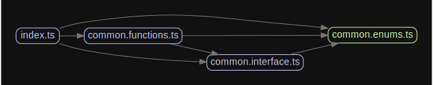

  

# Common Utilities
## Description

This API provides a few utility functions that are primarily meant for internal use.

## Dependency Graph

  

## Stay in touch

- Author - [Troy Morvant](https://github.com/troymorvant)
- LinkedIn - [https://linkedIn/TroyMorvant](https://linkedIn/TroyMorvant)
- Twitter - [@t33b0n35](https://twitter.com/t33b0n35)

