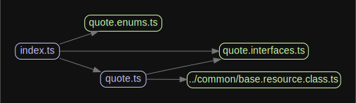

<p align="center">
  <a href="http://nestjs.com/" target="blank"></a>
</p>

# CHAPTER API
## Description

This API provides easy access to all sorts of information relating to chapters from the LOTR Books
## Installation

```bash
$ yarn install @troymorvant/TROYMORVANT_SDK
```

## Using The Library

- Make sure you have your `LOTR_API_KEY` set in your environment variables
- Import the desired objects into your project
    ```typescript
    const quote = new Quote();
    ```
- (optional) Define request options and pass that to the function
  ```typescript
  import { Quote, QuoteFields, IRequestOptions } from '@troymorvant/troymorvant_sdk';
  
  const options: IRequestOptions = {
      sortOptions: {
        property: QuoteFields.DIALOG,
        direction: SortDirection.DESCENDING,
      },
      pagingOptions: {
        page: 1,
        offset: 0,
      },
    };
  
  const result = quote.getQuotes(options);
  ```
## Dependency Graph
<p align="center">
  <a href="http://nestjs.com/" target="blank"></a>
</p>

## Test

To run the tests, just clone this repository, then follow the instructions below:

```bash
# unit tests
$ yarn test
```

To run the e2e tests, you will need to store your API key in an environment variable called `LOTR_API_KEY`.  You can do this with the `export` command.
```bash
$ export LOTR_API_KEY=<RAPLACE WITH YOUR API KEY>
```
After the above step has been completed, you should be able to run the tests by simply executing the command below:
```bash
# e2e tests
$ yarn test:e2e
```

## Stay in touch

- Author - [Troy Morvant](https://github.com/troymorvant)
- LinkedIn - [https://linkedIn/TroyMorvant](https://linkedIn/TroyMorvant)
- Twitter - [@t33b0n35](https://twitter.com/t33b0n35)

